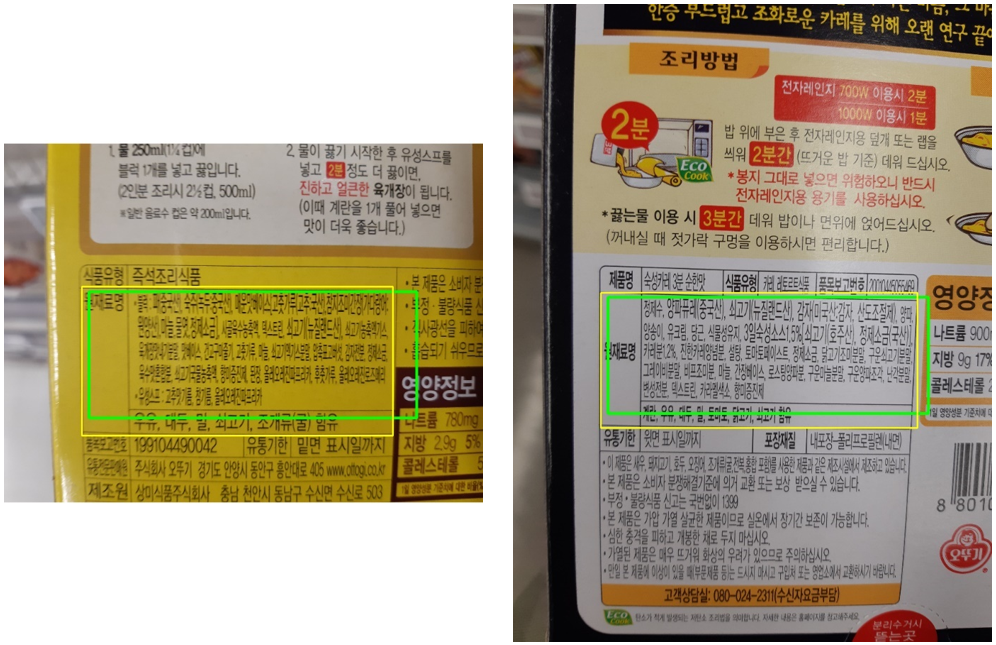
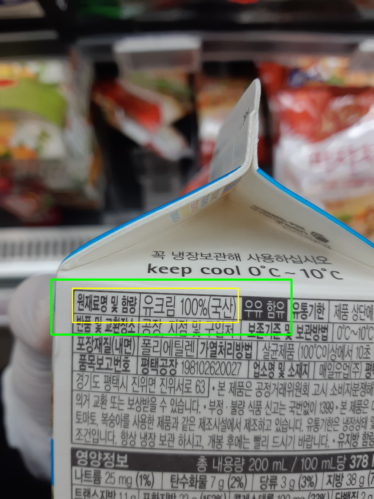

In this article I am describing my experience with working on **Object Detection** task in which I was detecting Ingredients section on food labels while learning *Pytorch* framework and experiencing new techniques and errors I’ve never seen before 😊. This was an absolutely educational project and the main purpose of it was to learn and practice new things. 

---
# Project motivation
After graduating university and chilling for a little while (writing thesis for Master of Engineering is quite a task) I found that gained knowledge fade pretty fast if you don’t use them (what a surprise!). So, I went on a quest of finding what I can do to keep my brain active, while learning new things. While already having some experience with Deep Learning the fact that I didn’t get much hands on Computer Vision problems bothered me. Earlier before that I took a course on Coursera about *[Deep Learning](https://www.coursera.org/specializations/deep-learning)* with famous professor Andrew Ng.  One of the series of lectures was about Object Detection and got me very excited. So, I decided to approach this problem not only in theory but in practice as well.

I didn’t see much value in taking a ready to go dataset, so I thought that preparing my own dataset from scratch would make it more “real”. But I didn’t have an idea what I can “detect” except for cute doggies. Until one day I found myself struggling to find an ingredients section on a pack of Korean kimbap. That’s how I decided I would make a detector of Ingredients sections on Korean food products.

I also wanted to learn new (for me) technologies to get as much value from this project as possible. I already had experience with *[Tensorflow](https://www.tensorflow.org/)* and *[Keras](https://keras.io/)*, but *[Pytorch](https://pytorch.org/)* kind of scared me always. So, I decided to face my fears and get my hands on *[Pytorch](https://pytorch.org/)*.

Though I didn’t use fancy architectures and techniques I still could face many challenges and learn a lot of useful things while working on the project.

# Outline
During this project explanatory article, I will describe:
-	[How I collected and processed data](),
-	[What model I used for training](),
-	[First results of training](),
-	[How I improved results with data augmentation](),
-	[Final results](),
-	[What I’ve learned while working on the project]().

# Collecting data and data preprocessing
To collect data, I visited several big stores in Seoul like Home Plus, Lotte Mart and COSTCO as well as some smaller grocery stores. So no one would get too interested in “what I am doing there” I talked to staff and asked for permission to take pictures of food labels explaining it with having a school project (though in reality it is after-school one). In result I took more than 900 pictures of labels of various food products. However, some of them were poor quality (too blurry, not the whole label was visible etc.), therefore I had to discard those examples and got 841 pictures for my dataset. Examples of collected pictures are shown in the Figure 1 below.

<p align = "center">
  <br>
  <b>Figure 1: Examples of the dataset</b>
</p>

Since some of the pictures were taken horizontally, I had to pad them with white color to the size of vertical picture. To do this I used *[Open CV](https://opencv.org/)* library. The example of results is shown in the Figure 2.

<p align = "center">
  <br>
  <b>Figure 2: Examples of padded pictures</b>
</p>

Next, I changed names of pictures from original to more standardized ones (img_0, img_1 etc.) and had to label ingredients (원재료명) and allergens. For that I used a *[Visual Object Tagging Toll](https://github.com/microsoft/VoTT)* (VoTT) from Microsoft and labeled every picture with one class ‘ingr’ which refers to ‘ingridients’. Example of labeling is shown in Figure 3.

<p align = "center">
  <br>
  <b>Figure 3: Example of dataset labeling in VoTT</b>
</p>

As a result I have gotten a csv file with coordinates for bounding boxes in Pascal VOC format (x_min, y_min, x_max, y_max) (Figure 4).

<p align = "center">
  <br>
  <b>Figure 4: Example of bounding boxes coordinates</b>
</p>

Original pictures’ size is 4608 x3456 (H x W). However, this is too much for abilities of my computer. Therefore, I needed to resize pictures to the smaller size (I’ve chosen 25% of the original size – 1152 x 864). Before resizing I converted all pictures from jpg to png format. Then I used *[Albumentations](https://albumentations.readthedocs.io/en/latest/index.html)* library to resize pictures and corresponding bounding boxes. Next, I had to split data to folders corresponding to train set, validation set and test set. I did it in ratio ~80%/10%/10% (671/85/85 pictures) respectively.

# Building the model
Since one of goals of this project was to get familiar with Pytorch framework I went straight to achieving it. I was following *[pytorch tutorial](https://pytorch.org/tutorials/beginner/finetuning_torchvision_models_tutorial.html)* to build a training model, bringing alternations where it is necessary. So, after importing libraries and defining parameters I needed to set up data loading process. Since I had pretty big images (even after resizing them) and not that much memory, I used pytorch *Dataloader* which allows to load data with batches from disk during the training process.

For datataloader I needed to write a class which would inherit pytorch *Dataset* class. Again, I used the guidance of another *[pytorch tutorial](https://pytorch.org/tutorials/beginner/data_loading_tutorial.html)*. In this class I load bounding boxes and images, apply to the last ones torchvision transforms (ToTensor and Normalize) and in return get the dictionary with ready to feed into the model image and bounding boxes.

Because I have very little data for the model, I took a pretrained ResNet-18 to have at least some more or less good weights to start with, even though my dataset is very different from ImageNet. Instead of the last layer with 1000 outputs (classes of ImageNet) I added a Linear layer with 4 outputs, corresponding to coordinates of a bounding box. To avoid spreading of a huge error (which would occur during first epochs in this Linear layer) to the rest of the network, I temporary froze all model’s layers except the last Linear one. After that I could send the model to GPU (I used Geforce GTX 960M, 4GB).

The last thing to do was to define loss function and optimizer. I tried to train with different combinations of those. For loss function I tried to train with MAE (L1) and MSE (L2) losses. And as for optimizers, I tried to train with SGD and Adam optimizers. The results of these trials will be described in next sections.

I trained the model for 50 epochs, unfreezing all layers after 6th epoch, with batch size of 2 and learning rate being 0.0001.

# First results of training
Before training the model on my own data I found it would be useful to try to train first on some ready dataset from the Internet. So, in case something would go wrong while training with my own data, I would know the problem is the data but not the pipeline. For this little “experiment” I chose *[The Oxford-IIIT Pet Dataset](https://www.robots.ox.ac.uk/~vgg/data/pets/)*. From it I chose only dogs’ pictures (since I needed to localize only one kind of objects in my problem as well). I’ve got in total 2498 pictures of dogs with corresponding bounding boxes, which I split to train (1998 pics), validation (250 pics) and test (250 pics) sets. I trained with hyperparameters mentioned previously, with SGD and L1 loss for 50 epochs and got some more or less descent results which you can see in the Figure 5. Through this I conducted that I could comfortably move to working with my own dataset.

<p align = "center">
  <br>
  <b>Figure 5: Examples of predictions on Oxford-IIIT Pet Dataset (yellow box – ground truth, green box - prediction)</b>
</p>

After training model on my own data (with the same settings and data split 671/85/85 for train, validation and train respectively) I found that the model is “thinking” to the right direction, but still cannot capture the needed area well. The examples for this training can be seen in Figure 6. Though some hope is visible, it is obvious I need more data to train on.

<p align = "center">
  <br>
  <br>
  <b>Figure 6: Examples of predictions after training on my own dataset</b>
</p>

# Improving results with data augmentation
To increase data amount fast it is possible to use data augmentation, where you slightly change the image by “playing” with its different parameters like color, brightness, orientation etc. There are two kinds of augmentation: offline augmentation and online (or “on the fly”) augmentation. I tried to apply them both (separately).

First, I went with offline augmentation. In this case augmentations are applied to training set beforehand. For this I used *[Scikit Image](https://scikit-image.org/)* library. I chose it because it has a very detailed documentation, the whole range of augmentations and its *PiecewiseAffine* can be applied to both image and bounding box (apart from *[Albumentations](https://albumentations.readthedocs.io/en/latest/index.html)*, where you can only apply it to the image). It is also a little bit easier to set up, in my opinion (read as “I’ve got less errors from it than from *[Albumentations](https://albumentations.readthedocs.io/en/latest/index.html)*”). After experimenting with different functions and their parameters I applied two sets of augmentation:

```
augment_1 = iaa.Sequential([iaa.PiecewiseAffine(scale = 0.035), iaa.MultiplySaturation(mul = 0.75)]) 
```

```
augment_2 = iaa.Sequential([
                        iaa.MotionBlur(k=3),
                        iaa.MultiplyAndAddToBrightness(mul = 1, add = 30),
                        iaa.MultiplySaturation(mul = 2),
                        iaa.AdditiveGaussianNoise(scale = 3)
                       ]) 
```

As a result, I could triple the size of my training set making it 2013 images. The example of original and augmented images can be seen in Figure 7 below.

<p align = "center">
  <br>
  <b>Figure 7: Example of augmentations (from left to right: original image, augment_1, augment_2)</b>
</p>

I trained the model once with the same settings as in case with original images and once with the same settings but with L2 loss instead L1. Both training cases showed better mean IoU (intersection over union metric) than the original one, but the case with augmented data and L2 loss showed the best performance. Examples can be seen in Figure 8.

<p align = "center">
  <br>
  <br>
  <b>Figure 8: Examples of predictions after training on augmented data with L2 loss</b>
</p>

Next, I tried to train with online augmentation. The idea behind this approach is that we augment images not in advance but during the training process. So, each time in each epoch when the image is loaded it is augmented (or not) in some way. Therefore, we have slightly different image each time. From what I have found on the Internet this approach works worse than offline one on tiny datasets like mine, but I still decided to give it a go. To use augmentations, I had to alternate my dataclass. Now it also accepts the Composition of augmentations and applies it in cases when the model is in the training mode. This time I used *[Albumentations](https://albumentations.readthedocs.io/en/latest/index.html)* library since it is a little bit faster than *[Scikit Image](https://scikit-image.org/)* and for this kind of task the speed is crucial.

First, I tried to apply suggested by *[Google’s researchers](https://arxiv.org/abs/1906.11172v1)* augmentations of Rotate and Equalize. But they didn’t bring better results. Probably because it is not a really good idea to try to rotate text, including the fact, that it already not aligned 100% horizontally due to the way I took pictures. Then I tried to train with different sets of augmentations for about 20 epochs each (to approximately see how they perform) and in the end used the following set of augmentations for training for the full number of epochs:

```
def aug_func(p=0.7):
    return Compose([
            OneOf([
                    Blur(blur_limit = 4, p=p),
                    MotionBlur(blur_limit = 6, p=p),
                    GaussianBlur(blur_limit=5, p=p)
                    ]),
            OneOf([
                    RandomBrightness(limit = 0.3, p=p),
                    RandomContrast(limit = 0.4, p=p),
                    RandomBrightnessContrast(brightness_limit = 0.25, contrast_limit = 0.35, p=p)
                    ]),
            OneOf([
                    HueSaturationValue(hue_shift_limit = 25, sat_shift_limit = 40, p=p),
                    Equalize(p=p)        
                    ]),
            ElasticTransform(alpha = 3, border_mode = 0, value = (255,255,255), p=0.5),
            GaussNoise(var_limit = (2,10), p=0.6)
            ], p=p)
```

For training I used the same settings and, again, tried to train with first L1 loss and then with L2. In both cases the model performed better than the model trained only on original images, but worse than in case with training on augmented beforehand images, so I will let myself omit showing examples of predictions this time. 

# Training with Adam optimizer and final discussions
In the end I tried to make my poor computer struggle and train with different sets with Adam optimizer (with default parameters) instead of SGD. The best results on test set gave offline augmented data with Adam and L2 loss. The examples of results can be seen in Figure 9.

<p align = "center">
  <br>
  <br>
  <b>Figure 9: Examples of predictions after training on offline augmented data with Adam and L2 loss</b>
</p>

The results got obviously better comparing to the very beginning. But the model still does not capture ingredients to the desired level of precision. And not all predictions are this good. There are still sometimes a missed predictions or predictions where it captures the whole ingredients section but also quite much around. But, in my thinking, the result is quite well, and this is the furthest I can get given amount of unique data I have and ambitiousness of the task. I could use some more complicated object detection algorithms like *[You Only Look Once (YOLO)](https://arxiv.org/abs/1506.02640)* or *[Faster RCNN](https://arxiv.org/abs/1506.01497)*. But more complicated algorithms also require more data to avoid overfitting. Therefore, my next steps are to gather more data (at least twice as much as I have now) and try to apply *single shot detection algorithms* and deeper networks like *[Faster RCNN](https://arxiv.org/abs/1506.01497)*. 

In the end of discussions, I would also like to share an interesting founding in model’s performance I got excited about. During the data labeling process, I made a mistake on a picture and didn’t include the allergens in a bounding box. But the model noticed it and captured allergens anyway. Though it still captured a little bit too much around, it still could not only localize ingredients of the product but also corrected my own mistake 😊. I include this example in Figure 10 below.

<p align = "center">
  <br>
  <b>Figure 10: A prediction of the model correcting the human</b>
</p>

# Conclusions and what I’ve learned
During this project I approached an object localization task with applying transfer learning (pretrained on ImageNet ResNet-18). I could not only practice things I already knew but also learned a lot of new ones. First of all, I learned in firsthand how hard it is to gather and prepare image data for training (and how to do it at all). Since I did not have much experience of working with computer vision tasks before I could also learn new about image processing and augmentation, as well as helping with this libraries like *[Open CV](https://opencv.org/)*, *[Scikit Image](https://scikit-image.org/)* and *[Albumentations](https://albumentations.readthedocs.io/en/latest/index.html)*. Additionally, I could work with a new (for me) framework *[Pytorch](https://pytorch.org/)*. 

Apart from getting mentioned technical skills, I also got better with using documentations and reading source code. And I needed that A LOT! First, during following *[Pytorch](https://pytorch.org/)* tutorials I had to understand what each function did and where it came from. Then, during learning about how to apply augmentations and using according libraries. And finally, during fighting endless errors I’ve got after trying to run all the code I wrote.

I am sure all the gained skills and experiences will help me with my future projects. 

In the end I can say I have gotten a lot of positive emotions while working on this project. And not just when I’ve got final results. Even after first training attempt, I’ve got a big smile while scrolling through test set predictions. Though most of them were pretty bad, the fact that the model is “thinking” in the right direction and can kind of locate the ingredients made me very excited. It made me want to learn further about object detection and complete more exciting projects.

**Thank you for reading!**
