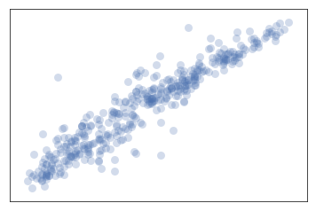
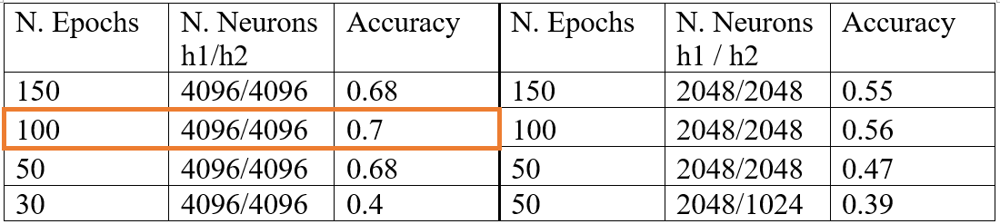
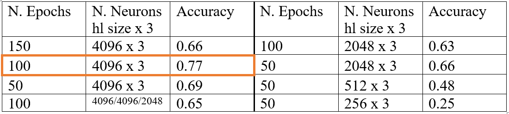
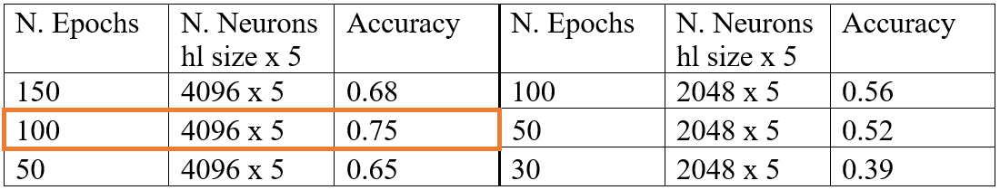
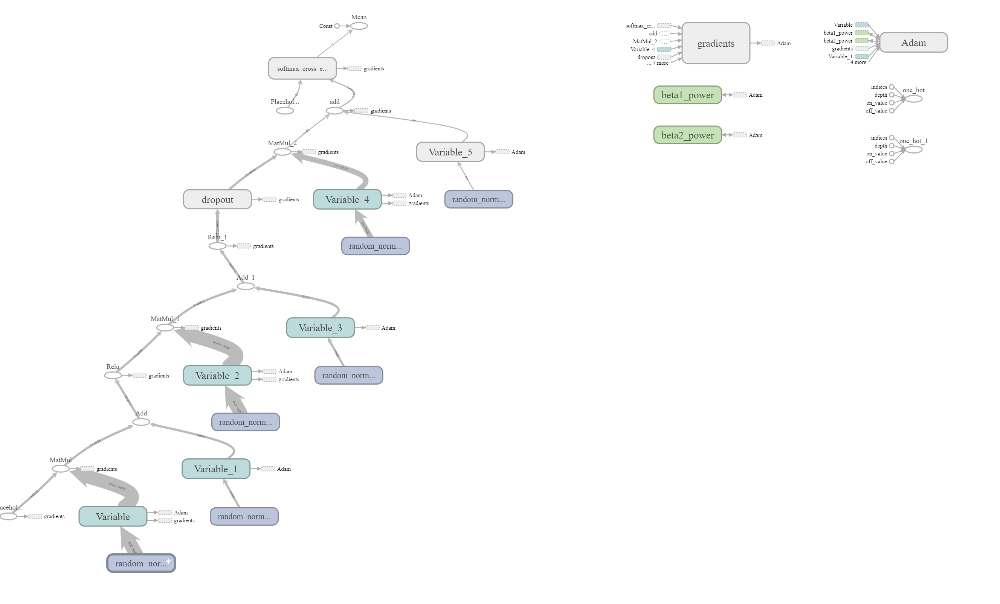

The following text is a report on assignment which was done for the subject "Artificial Intelligence" in the first semester of school year 2018. The task is similar to abother assignment in the repository - to classify Olivetty dataset. However, in case of this assignment the classification must be done with FFNN and CNN written with Tensorflow. Therefore, the assignment was aproached differently.

---

# Comparison of the Performance of Different Deep Neural Network Models Fitted to Olivetti Dataset

# Introduction
In this work I compare results of classification of DNN with different architecture on Olivetti dataset. Types of networks used for comparison are regular feed-forward neural network with different depth of hidden layers and CNN with different architecture. 

# Dataset description
The dataset chosen for comparison of classification by using DNN is The *[Olivetti faces dataset](https://scikit-learn.org/0.19/datasets/olivetti_faces.html)*. It contains 400 black and white pictures of 40 people (10 pictures per person). For some subjects, the images were taken at different times, varying the lighting, facial expressions (open / closed eyes, smiling / not smiling) and facial details (glasses / no glasses). All the images were taken against a dark homogeneous background with the subjects in an upright, frontal position (with tolerance for some side movement). The task is to classify those pictures by person. After loading dataset from sklearn 400 samples and 4096 features were obtained. The loader converted images to floating point values on the interval \[0, 1]. The dataset was split into train set and test set (300 and 100 samples respectively). The graphical representation of the data can be seen on the Picture 1.

   
  <b>Picture 1. Graphical representation of The Olivetti faces dataset</b>

# Feed-Forward Neural Network
**Feed-Forward Neural Network with two hidden layers**

The first chosen model to classify the given dataset is a simple feed-forward neural network with two hidden layers. I start with randomly initializing weights and biases of the network for each hidden layer and the output layer. Then I define our hidden layers and the output layer:

*1st hidden layer*: the input for the layer is our data. I multiply these data by weights initialized for the first layer, using matrix multiplication, and add biases to the result. Then I apply rectifier activation function to the output of the layer 1.

*2nd hidden layer*: the output of hidden layer 1 I pass as an input for hidden layer 2. I multiply it by initialized for layer 2 weights and add biases. And again, apply ReLU.

*Output layer*: the out of the hidden layer 2 I pass as an input for the final, output layer. I multiply it by initialized for the output layer weights and add biases and getting the output (or prediction).
After getting the prediction I need to calculate the cost function – the difference between the prediction and actual labels. I calculate it using softmax cross entropy with logits. 

The optimizer, chosen to minimize the cost function is advanced gradient descent method Adaptive Moment Estimator – Adam. The method is a combination of two other methods: AdaGrad and RMSProp. The main idea behind it is the Adam method computes individual adaptive learning rates for different parameters from estimates of first and second moments of the gradient. The parameter of learning rate chosen by default equaled 0.001. 

After determining the structure of the network, I train it for the certain number of epochs. Depending on number of epochs and number of neurons in every hidden layer the network classifies worse or better. The results of accuracy, depending on those parameters, are displayed in the Table 1 below.

It can be seen from the table that the best performance (0.7) is shown by the network with 4096 neurons in both hidden layers in 100 epochs.

It is also visible that while reducing the number of neurons in the network the performance drops as well.

   
  <b>Table 1. Parameters dependent performance of Feed-Forward Neural Network with 2 hidden layers </b>

**Deeper Feed-Forward Neural Network**

It is well known that by increasing the number of hidden layers it is possible to improve the performance of the network. And I am aiming to verify that by trying to increase the number of hidden layers in the network to 3 and 5 hidden layers.
The structure of the network is the same as in the previous model with two hidden layers: 

-	all hidden layers computed in the same way;
-	ReLU is applied to every hidden layer;
-	the output of the last hidden layer is the input for the output layer.

The results of performance for networks with 3 and 5 hidden layers are displayed in the Table 2 and Table 3, respectively.

   
  <b>Table 2. Parameters dependent performance of Feed-Forward Neural Network with 3 hidden layers</b>

It can be seen from the Table 2 that the best performance (0.77) is shown by the network with 4096 neurons in all hidden layers in 100 epochs. It is better result than in similar scenario in case of network with just two hidden layers.

The results also verify the observation made previously, that the performance of the network decreases along with number of neurons in hidden layers.

   
  <b>Table 3. Parameters dependent performance of Feed-Forward Neural Network with 5 hidden layers </b>

It can be seen from the table 3, that keeping making the network deeper does not show much improvement. It may happen because of accumulating of the error as the network goes deeper. 

**Adding a dropout to a Feed-Forward Neural Network**
To avoid overfitting problem and improve the performance of the network some sort of regularization might be needed. I am using dropout.

What it does is it ignores neurons in the layer with the given probability. It is applied after applying activation function to the layer. Applying dropout also follows to the need of running more epochs.
I have tested adding different dropout to different layers of two Feed-Forward Neural Networks (with 2 and 3 hidden layers) with best parameters.

For the networks with 2 hidden layers the results are following:

-	Adding 0.25 dropout to layer 1 leads to obtaining accuracy of 0.57 in 400 epochs;
-	Adding 0.5 dropout to layer 1 leads to obtaining accuracy of 0.77 in 300 epochs;
-	Adding 0.5 dropout to layer 2 leads to obtaining the best accuracy for the network of 0.8 in 300 epochs;
-	Adding 0.25 dropout to the first hidden layer and 0.5 dropout to the second hidden layer ruins the performance of the network, giving the accuracy 0.09 in 300 epochs.

In case of the network with 3 hidden layers the situation is similar. The best result of accuracy 0.8 in 300 epochs gives adding 0.5 dropout to the last hidden layer.

**Results for a Feed-Forward Neural Network**

While networks with 2 hidden layers and 3 hidden layers with added to the last layer of both dropout show the same result in terms of accuracy (0.8), I think that the best network to classify data from Olivetti dataset would be the network with 3 hidden layers. Since it has less layers, it has less neurons to compute, which means it would compute faster. The final structure of the network was obtained with Tensorboard and shown on the Picture 2.

   
  <b>Picture 2. Tensorboard representation of the structure of network with 2 hidden layers</b>

# Convolutional Neural network (CNN)
To increase the accuracy on the Olivetti dataset Convolution Neural Network was designed. Apart from previously used regular feed-forward neural network (or multilayer perceptron), it is making use of convolution and pooling layer. Which helps to increase the performance in terms of accuracy dramatically.

I have tested CNNs with two different architectures which I describe in the following sections.

**Simple implementation of CNN**

The first network has learned 32 convolutional filters, each with a size of 3 x 3. The output dimension is the same one of the input shape, which is one input channel 64 x 64. Activation function is ReLU. Then there is another convolutional layer with same parameters (apart from input shape) followed by max-pooling operator with a pool size of 2 x 2 and a dropout at 25%. Next goes a dense network with 128 units and ReLU activation function with dropout at 50% following it. The last layer is softmax one with 40 classes as output.

Shortly the structure of the network might be presented as following:

<i>conv + conv + maxpool + dropout + dense + dropout + dense</i>

The obtained accuracy is 0.93 in 2000 steps.

**A deeper CNN to classify the data**

As in the case with regular feed-forward network I am aiming to test if making the convolutional network deeper will give much increase in accuracy.

The architecture of this CNN is same as the previous one, but after first max pooling I add two more convolution layers with ReLU activation with following another max pooling with a pool size of 2 x 2. Which gives the following structure:

<i>conv + conv + maxpool + dropout + conv + conv + maxpool + dense + dropout + dense</i>

Current architecture does not show a big increase of accuracy comparing to the previous CNN. The obtained accuracy is 0.94 in 2000 steps. But by running this network for 3000 steps it is possible to see the improvement and get accuracy equaled 0.96. 

# Comparison of performance Feed-Forward Neural Network and Convolutional Neural Network

The highest accuracy obtained by the multilayer perceptron from the Section 3 is 0.8. While the highest accuracy obtained by the CNN from the Section 4 is 0.96. It is higher than accuracy obtained by MLP on 0.16, which is a big improvement. Although the computational time increases comparing to MLP, in my opinion, to get a better accuracy is more important.

Therefore, the best Deep Neural Network for classifying Olivetti dataset would be a Convolutional Neural network with the following architecture:

<i>conv + conv + maxpool + dropout + conv + conv + maxpool + dense + dropout + dense</i>

# Conclusion
In this work several feed-forward neural networks and convolutional neural networks with different architecture were applied to Olivetti dataset to solve classification problem. After compering of performances of each network it can be concluded that the most suited network to classify Olivetti dataset would be convolutional neural network.
