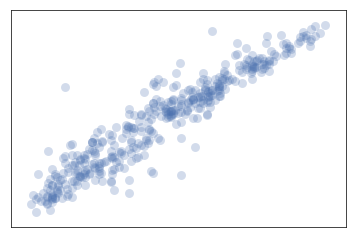
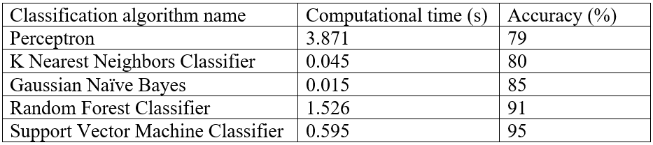
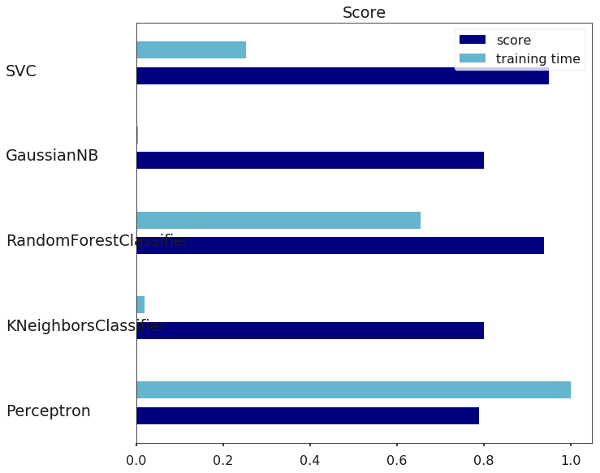
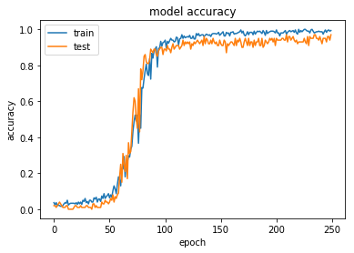
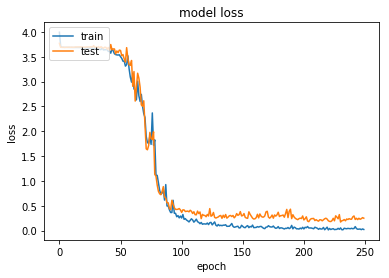
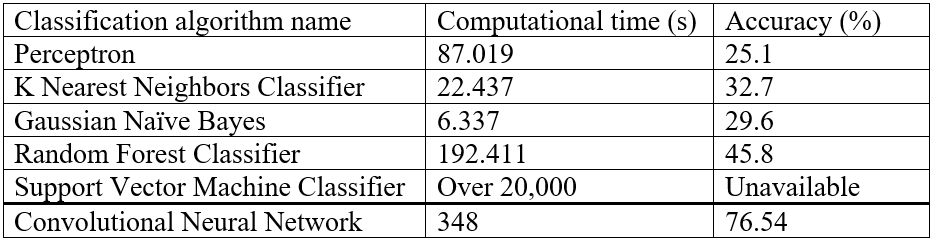
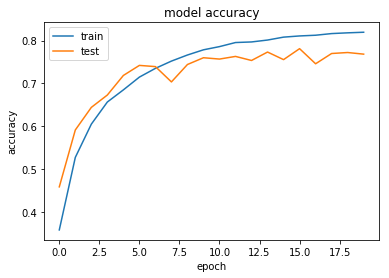
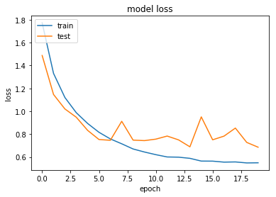

The following text is a report on assignment which was done for the subject "Pattern Recognition" in the first semester of school year 2018. The task is similar to abother assignment in the repository - to classify Olivetty dataset. However, in case of this assignment the classification must be done with sklearn and Keras libraries. Therefore, the assignment was aproached differently.

---

# Classification algorithms comparison

# Introduction
In this work I compare results of different standard classification algorithms and CNN performance on *[Olivetti dataset](https://scikit-learn.org/0.19/datasets/olivetti_faces.html)*. After that I apply the same algorithms and CNN (with different architecture) to *[CIFAR-10 dataset](https://www.cs.toronto.edu/~kriz/cifar.html)*, for the better understanding of results.

# Dataset description
The dataset chosen for comparison of classification algorithms is The Olivetti faces dataset. It contains 400 black and white pictures of 40 people (10 pictures per person). The task is to classify those pictures by person. After loading dataset from sklearn 400 samples and 4096 features were obtained. The loader converted images to floating point values on the interval [0, 1]. The dataset was split into train set and test set (300 and 100 samples respectively). The graphical representation of the data can be seen on the Picture 1.

   
  <b>Picture 1. Graphical representation of The Olivetti faces dataset</b>

# Results of classification
Chosen for classification algorithms are Perceptron, K Nearest Neighbors Classifier, Random Forest Classifier, Gaussian Naïve Bayes and Support Vector Machine Classifier.

To evaluate performance of algorithms accuracy score and computational time were calculated. Results can be seen in the Table 1 below.

   
  <b>Table 1. Results of classification algorithms’ performance applied to Olivetti dataset</b>

Results are also compared visually on the Picture 2 below.

   
  <b>Picture 2. Visual comparison of classification results</b>

Also, I tried to classify the dataset using Convolutional Neural Network. Due to big difference with standard classification algorithms, the result of classification using CNN is not included in the Table 1 and described separately in section 4.

# Results of classification using CNN
For classification using deep learning technique a standard example of CNN was taken and fitted to the Olivetti dataset. The net has learned 32 convolutional filters, each with a size of 3 x 3. The output dimension is the same one of the input shape, which is one input channel 64 x 64. Activation function is ReLU. Then there is another convolutional layer with same parameters (apart from input shape) followed by max-pooling operator with a pool size of 2 x 2 and a dropout at 25%. Next goes a dense network with 128 units and ReLU activation function with dropout at 50% following it. The last layer is softmax one with 40 classes as output.

The described network reached accuracy of 97% with 250 epochs on Olivetti dataset. Computation took approximately 1000 seconds (on average 4 seconds per epoch and 12 ms per step).

Picture 3 and Picture 4 below show that reported accuracy and loss achieved by the net on both train and test datasets.

   
  <b>Picture 3. Model of accuracy for CNN trained on Olivetti dataset</b>

   
  <b>Picture 4. Model of loss for CNN trained on Olivetti dataset</b>

# Results discussion
According to both accuracy and computation time results the worst performance was shown by Perceptron algorithm. It took the longest 3.871s to compute, while the fastest Gaussian NB algorithm showed performance 0.015s. The accuracy performed by Perceptron algorithm is the lowest 79%, since the algorithm traditionally performs not very efficiently with many features (4096 features per input in case of chosen dataset).

The second classification algorithm is K Nearest Neighbors (KNN). It is computed almost as fast as Gaussian NB – 0.045s. However, accuracy result is just 1% better than in case with Perceptron. It works well in case when there are many classes to classify to, traditionally fast but not efficient when there are not enough representative data (which may be the case with the chosen dataset, since there are only 10 images per class available).

Gaussian Naïve Bayes classification algorithm was the fastest among other chosen algorithms to compute – 0.015s. The accuracy score is 5% higher than in case with KNN, which is 85%. Gaussian NB is traditionally computationally fast and works well with high dimensions.

Random Forest Classification algorithm (RF) is slower than KNN and Gaussian NB with time spent on computation equaled 1.526s. However, accuracy score is significantly higher – 91%. The main idea behind this algorithm is that many regular decision trees are generated, they search for certain patterns and then results are combined. Due to that the algorithm performs quite accurately (especially on large datasets which is proven in section 6), but the same reason leads to increasing of computation time.

The best performed algorithm on Olivetti dataset, in my opinion, is Support Vector Machine Classification algorithm (SVC) with accuracy score equaled 95% and computational time 0.595s. The algorithm is traditionally very accurate especially on small datasets, which makes it perfect for the chosen data. Computation time is not that high as well. Of course, it is important for an algorithm to be calculated fast, as for example KNN and Gaussian NB, but SVC’s accuracy is higher on 15% and 10% respectively, which is more important, including the fact, that computation was made not that much slower. However, it should be noted that SVC is not suitable for larger datasets, which is perfectly shown in the section 6. But for Olivetti dataset it performs optimally best.

In terms of accuracy CNN performs better than SVC: 97% in case of cnn against of 95% in case of SVC. But this is not that big difference. Additionally, in case of Olivetti dataset time to train the CNN is significantly higher than in case of described higher algorithms taken all together (about 1000 s against 6.052 s respectively). In my opinion CNN is too complex for this problem and using the regular classification algorithms, such as SVC or Random Forest, is enough.

However, using CNN for classification might be reasonable in case of significantly larger dataset, where standard classifiers cannot perform well, which is shown in the next section.

# Classification results of CIFAR-10
In this section I am trying to apply to the dataset CIFAR-10 same algorithms which were used to classify Olivetti dataset in previous sections. Also, CNN, different from the one fitted to Olivetti dataset, was used to classify CIFAR-10.

**Dataset description**

CIFAR-10 dataset contains 60,000 images of 32 x 32 pixels in 3 channels of 10 different classes. It is split to training set and test set (50,000 and 10,000 images respectively). The task is to classify those images by 10 classes. The dataset contains 60,000 samples with 3072 features for each.

**Results of classification**

With CIFAR-10 were used same classification algorithms as in previous sections as well as CNN. Results of classification can be seen in the Table 2 below.

   
  <b>Table 2. Results of classification algorithms and CNN’s performance applied to CIFAR-10 dataset</b>

As it is seen from the Table 2 standard classification algorithms could not perform on CIFAR-10 as well as on Olivetti dataset, while CNN showed significantly higher performance in accuracy score, comparing to them. CIFAR-10 contains almost 7 times more features than Olivetti dataset, which makes it harder to process for most of algorithms. The worst accuracy performance was shown by Perceptron algorithm – 25.1%, while the best one was shown by Random Forest algorithm – 45.8%, which is still not good enough for classification task. While CNN could reach accuracy 76.5%. The architecture of CNN used to classify CIFAR-10 dataset is described in the subsection 6.3.

I am not considering computational time, since CNN was computed on GPU, while other algorithms were computed on CPU. Though it worth to note that SVC algorithm is not suitable for this dataset. Due to lack of computational resources it was not possible to finish classification with SVC. By the time of cancelation, the process was running for more than 20,000 second. Comparing to the longest (out of rest algorithms) Random Forest with computational time equaled 192.4s, it shows that using SVM as classification algorithm for CIFAR-10 is inefficient.

Looking at all results together it is fair to say that they prove statements made about listed algorithms in the section 5.

**CNN architecture**

The CNN architecture for classifying CIFAR-10 dataset was taken from the book by A. Gulli and S. Pal “Deep Learning with Keras” (2017). In the book authors firstly use a standard network very similar to the one I used on Olivetti dataset and obtain accuracy 66.4% in 20 epochs. After that they decide to change it into deeper network with the following structure:

<i>conv + conv + maxpool + dropout + conv + conv + maxpool + dense + dropout + dense</i>

All used activation functions are ReLU.

With this CNN structure it was possible to reach accuracy 76.5% in 40 epochs. Picture 5 and Picture 6 below show that reported accuracy and loss achieved by the net on both train and test datasets.

   
  <b>Picture 5. Model of accuracy for CNN trained on CIFAR-10 dataset</b>

   
  <b>Picture 6. Model of loss for CNN trained on CIFAR-10 dataset</b>

# Conclusion
In this work five standard classification algorithms and Convolutional Neural network were applied to Olivetti and CIFAR-10 datasets to solve classification problem. After compering of performances of each algorithm it can be concluded that the most suited algorithm for Olivetti dataset, due to dataset’s small size, is Support Vector Machine Classification algorithm. Oppositely it was found out that for larger and more complicated dataset, such as CIFAR-10, SVC is not suitable and it is better to use deep CNN with the architecture described in subsection 6.3.

The code for computing results for both datasets can be found in the following files:

─	cifar10_classification.py

─	cifar10_cnn.py

─	olivetti_classification.py

─	olivettin_cnn.py
