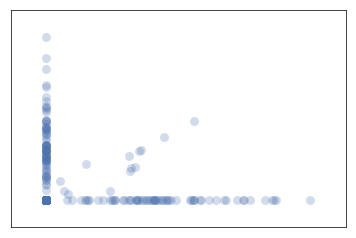
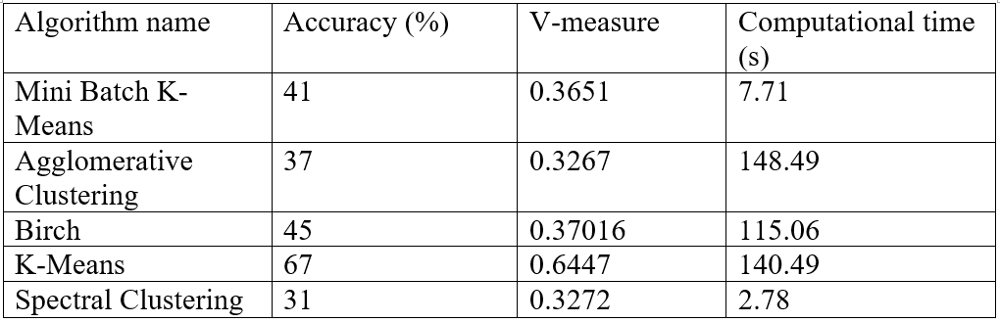
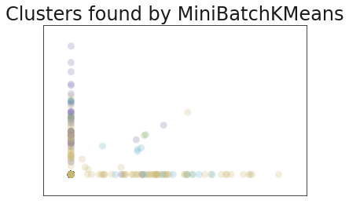
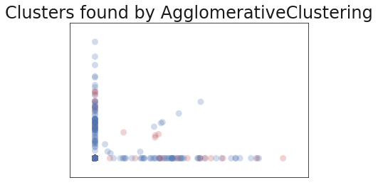
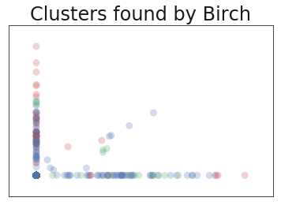
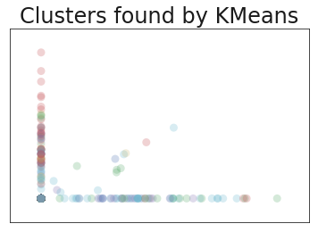
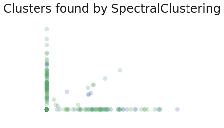

The following text is a report on assignment which was done for the subject "Pattern Recognition" in the first semester of school year 2018.

---

# Clustering algorithms comparison

# Dataset description
The dataset chosen for the clustering algorithms comparison is *[20 News Group dataset](https://scikit-learn.org/0.15/datasets/twenty_newsgroups.html)*. For better performance of clustering 6 different on topics categories of news was chosen: Mac hardware, autos, computer graphics, space, hockey and medicine. 2359 articles ware obtained. After features extraction 2359 n_samples and 36922 n_features were obtained. The graphical representation of the data can be seen on the Figure 1.

   
  <b>Figure 1: Graphical representation of 20NG dataset</b>

# Results of clustering
The chosen for clustering algorithms were K-Means (KM), Mini Batch K-means (MBKM), Spectral Clustering algorithm (SC) and two hierarchical algorithms: Agglomerative Clustering (AC) and Birch (BR).

To evaluate performance of algorithms accuracy score, v-measure and computational time were calculated. The results can be seen in the Table 1 below.

   
  <b>Table 1: Results of evaluating of clustering algorithms’ performance</b>

# Results discussion
According to V-measure all the algorithms performed similarly with the value 0.3-0.4, except for KM algorithm which V-measure value went higher 0.6, which is very good result. If to look at the accuracy, then it can be seen, that results are similar to V-measure results: 67% for KM and 30-40% for other algorithms.

However, computation time makes a difference. The fastest algorithm is SC – 2.78s. This can be explained that before clustering the algorithm performs dimensionality reduction to fewer dimensions. Which can allow it to perform fast on large and highly dimensional datasets like 20NG. Though the same reason may lead to a lower clustering quality.

Oppositely computational time of BR and AC is 115.06s and 148.49s, respectively. These two algorithms are both hierarchical. And, as well known, hierarchical algorithms originally have quadratic time complexity. Which cause such a high computational time.

It seems like KM algorithm would be the best to choose for 20NG dataset with the accuracy of clustering 67%. But in my opinion the best algorithm to choose would be MBKM. Its accuracy and V-measure values are relatively high, as well as computational time, which is 7.71s. Though the goal of the clustering is to cluster well, but not fast, the original 20NG dataset contains 18,845 samples with over 128,000 features. Which increases computational time of every algorithm in times. However, if computational resources allow to process that amount of data relatively fast, I would choose KM algorithm for clustering due to obtained high accuracy. But I have tried to run it on the full 20NG dataset overnight and computations still were not completed. SC algorithm has the lowest computational time, but quality of clustering is the lowest as well.

# Graphical implementation of clustering results 

In below figures the graphical implementation of clustering results is displayed.

   
  <b>Figure 2: Clustering results using Mini Batch K-Means algorithm</b>

---

   
  <b>Figure 3: Clustering results using Agglomerative Clustering algorithm</b>

---

   
  <b>Figure 4: Clustering results using Birch algorithm</b>

---

   
  <b>Figure 5: Clustering results using K-Means algorithm</b>

---

   
  <b>Figure 6: Clustering results using Spectral Clustering algorithm</b>

