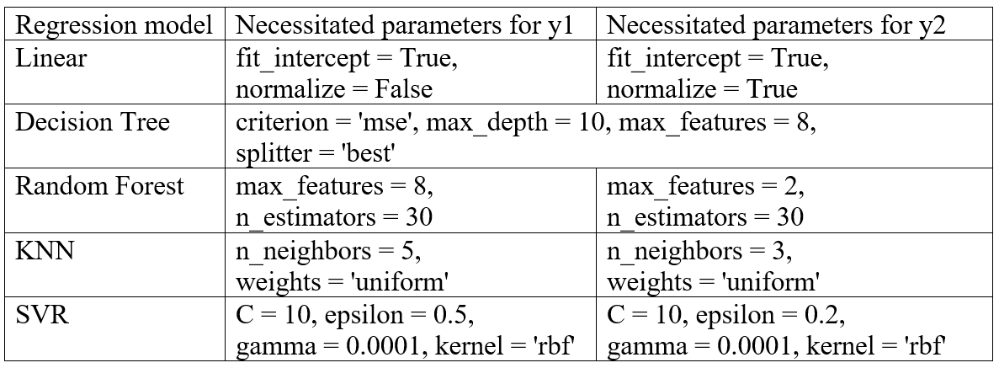
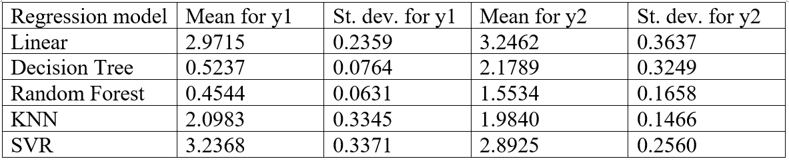
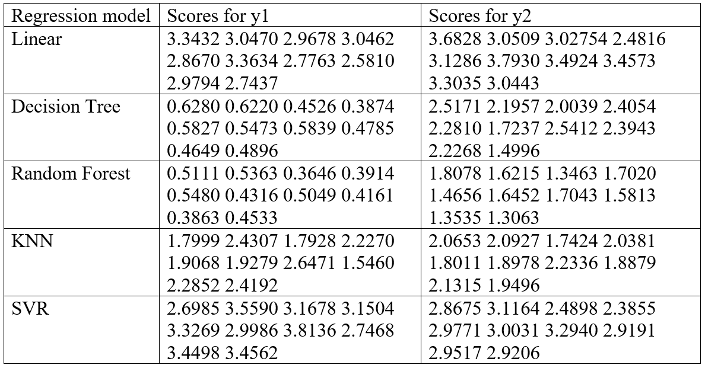
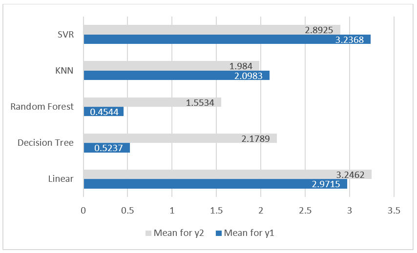
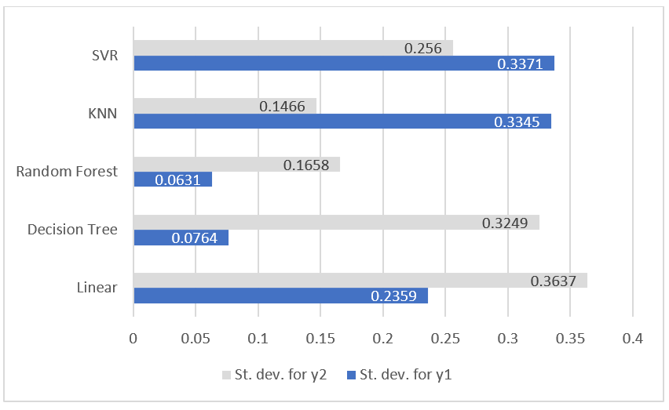

The following text is a report on assignment which was done for the subject "Artificial Intelligence" in the first semester of school year 2018.

---

# Comparison of the Performance of Regression Models Fitted to Energy Efficiency Dataset

# Introduction
Through the following work I compare different regression models’ performance on Energy Efficiency dataset. To find the best model and parameters for it such techniques as cross-validation and grid search were used. Regression models used for the analysis are following: Linear Regression, Decision Tree Regression, Random Forest Regression, Support Vector Regression and K-Nearest Neighbor Regression. To perform analysis such libraries were used as Pandas (for dataset importing), Numpy (for calculations) and SKlearn (for working with regression models). 

# Dataset description
The dataset chosen for comparison of regressors’ performance is *[Energy Efficiency dataset](http://archive.ics.uci.edu/ml/datasets/Energy+efficiency)*, obtained from *[UCI repository](http://archive.ics.uci.edu/ml/index.php)*. The dataset contains eight attributes (or features, denoted by X1...X8): relative compactness, surface area, wall area, roof area, overall height, orientation, glazing area, glazing area distribution. And two responses (or outcomes, denoted by y1 and y2): heating load and cooling load. The dataset comprises 768 samples and 8 features, aiming to predict two real valued responses.

The dataset was split into eight independent values, stored in the variable X, and two dependent values, stored in variables y1 and y2. I am aiming to find out which model and with which parameters is the best for making predictions for these two variables.

Since in most regression algorithms feature scaling is already implemented, it is not needed to do separately. Shuffling of the dataset is also implemented while doing cross-validation step (in KFold), therefore it is not needed to be performed either.

# Grid search process description
Before fitting regression models to the dataset, it is needed to be known with which parameters it would perform the best way. For that grid search was performed. What this method does is, basically, it tries different combinations of parameters and chooses which combination is the best for a certain dependent variable in the dataset. Since in the dataset there are two dependent variables I need to perform grid search twice for each model and for each y.

For cross-validation step (cv), performed inside of this method, 10 folds were chosen. The scoring parameter (scoring) is chosen as mean squared error which is returned as negative value (neg_mean_squared_error).

The result of grid search is shown in the Table 1 below.

   
  <b>Table 1: Grid search results for regression models for each of y’s</b>

# Results of cross-validation
To evaluate how well each model fits into the chosen dataset it is important to perform cross-validation. Its main intuition is that the algorithm takes N folds of data from the dataset and fits the model N times (to each of obtained folds). Then the prediction is made for previously unseen fold of data. In my case I find out the number of N with KFold method (10 folds were obtained). Scoring is chosen as neg_mean_squared_error. Parameters for each model were obtained with grid search in the previous section.

After performing cross-validation scores, mean and standard deviation values were obtained. The closer the mean and standard deviation are to zero, the better the model fits the data. It is also important to check visually if obtained scores are not too sparse. If it is sparse then it means that the model does not fit the chosen data well (or oppositely it fits too well).

Results of cross-validation for each model and each y are listed in Table 2 and Table 3. Visual comparison of mean and standard deviation values’ for y1 and y2 can be seen on Figure 1 and Figure 2.

   
  <b>Table 2: Results of cross-validation (mean and standard deviation)</b>

---

   
  <b>Table 3: Results of cross-validation (scores)</b>

---

   
  <b>Figure 1: Comparison of mean value for y1 and y2</b>

---

   
  <b>Figure 2: Comparison of standard deviation value for y1 and y2</b>

# Results discussion
If to look at results of cross-validation in the section 4 it can be seen that SVR and Linear Regression show the worst performance in terms of mean and standard deviation values. Those values for mentioned models are too high, comparing to other models. Which tells that these two models do not fit given dataset well. That can be explained by the fact that the chosen data do not follow linear trend, while SVR and Linear Regression are more suitable for linear tasks. Even though SVR was used with the kernel (rbf), which must make it work with non-linear tasks better, result is still not good.

KNN and Decision Tree models performed about similarly. In some case the result of KNN is better, while in another Decision Tree shows better performance. But if to take in account mean and standard deviation for both y1 and y2, it is hard to choose between two models. Though Decision tree obviously does better predictions for y1, while KNN predicts more accurately for y2.

KNN is fast with learning, but when it comes to testing it takes more time, since most of computations are made at that stage. But, in case of Energy Efficiency dataset, computational time does not matter that much since the dataset is relatively small. Though this fact might be also the reason why KNN does not performs its best, since this model usually shows better results when it has more samples. However, looking at scores obtained while cross-validating Decision Tree Regression model, it seems like it overfits the data. Which is not good and know as one of the main cons of this model. Hence, if to choose between KNN and Decision Tree which model fits existing data better, I would say it is KNN.

The best performing regression model on Energy Efficiency dataset is Random Forest Regression model. Its mean and standard deviation values are the least among screened regression models for both y1 and y2. Additionally, looking at scores, it does not seem like it overfits data (though this model is known to be more prone to overfitting than Decision Tree Regression model). This high performance might be explained by looking at the way Random Forest works. The main idea behind this algorithm is that many regular decision trees are generated, they search for certain patterns and then results are combined. Due to that the algorithm performs quite accurately (especially on large datasets), but the same reason leads to increasing of computation time. But, again, it is not the case, since chosen dataset is not that big.

Therefore, the best regression model to predict heating load and cooling load of the building based on given data X is Random Forest Regression model, with parameters n_estimators equaled 30 for both y1 and y2, and max_features equaled 8 for y1 and max_features equaled 2 for y2.

# Conclusion
In this work five regression models (Linear Regression, Decision Tree Regression, Random Forest Regression, Support Vector Regression and K-Nearest Neighbor Regression) were fitted to Energy Efficiency dataset to find out which model can predict better. After comparing of performance results of each model, obtained with cross-validation (with the help of grid search performed to obtain best models’ parameters for fitting), it can be concluded that the most suitable regressor for Energy Efficiency dataset is Random Forest Regression model.
