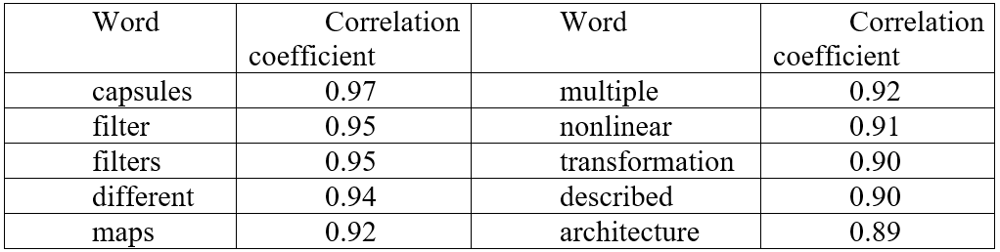

The following text is a report on assignment which was done for the subject "Big Data" in the second semester of school year 2018.

---

# Creating a word cloud with R language

# Introduction
In this work I analyze the text obtained from six research papers, using word clouds, which I build with the help of libraries and functions provided with R language. Then I find out how words of the obtained corpus are associated to the most frequent word of the corpus.

# Dataset (Corpus) description
**Original data**

To prepare the dataset for the current work I have chosen six papers which are related to text analysis and capsule networks, presented by Geoffrey Hinton in 2017. The papers are the following:

-	 *[Geoffrey E Hinton, Alex Krizhevsky, and Sida D Wang. Transforming auto-encoders. In International Conference on Artificial Neural Networks, pp. 44–51. Springer, 2011](https://www.cs.toronto.edu/~hinton/absps/transauto6.pdf)*.

-	*[Sara Sabour, Nicholas Fross, and Geoffrey E Hinton. Dynamic routing between capsules. In Neural Information Processing Systems (NIPS), 2017](https://arxiv.org/abs/1710.09829)*.

-	*[Sara Sabour, Nicholas Fross, and Geoffrey E Hinton. Matrix capsules with EM routing. International Conference on Learning Representations (ICLR 2018), 2017](https://www.cs.toronto.edu/~hinton/absps/EMcapsules.pdf)*.

-	*[S. Lai, L. Xu, K. Liu and J. Zhao, Recurrent Convolutional Neural Networks for Text Classification, AAAI, pp. 2267-2273, 2015](https://www.aaai.org/ocs/index.php/AAAI/AAAI15/paper/view/9745)*.

-	*[Wei Zhao, Jianbo Ye, Min Yang, Zeyang Lei, Soufei Zhang, Zhou Zhao, Investigating Capsule Networks with Dynamic Routing for Text Classification, arXiv preprint arXiv: 1804.00538, 2018](https://arxiv.org/abs/1804.00538)*.

-	*[Jaeyoung Kim, Sion Jang and Sungchul Choi, Text Classification using Capsules, arXiv preprint arXiv: 1808.03976, 2018](https://www.sciencedirect.com/science/article/abs/pii/S0925231219314092)*.

To start preparing the corpus, first, I needed to convert the text from these papers (which were originally in pdf format) into simple text in the file with the txt extension. While doing this I excluded the “References” section of all six papers as well as formulas found in those, since that information would not be helpful for the future text analysis.

**Data preprocessing process**

After creating the first corpus of data I have gotten a list of twenty documents in it. But to be able to make a word cloud based on it I needed to preprocess the data. First it was required to remove all the extra white spaces. After that I converted all uppercase letters into lowercase ones. After that all punctuation was removed, since it is not needed in this kind of task. Also, I removed all the numbers from the corpus since they do not give a relevant information for us. Further I had to remove most common stop words in English language from the text, since they would not do a real impact to the text analysis. After that I ran the function to remove white spaces again to make sure the corpus is fully prepared for the further analysis.  Then I constructed a Term Document matrix with the function TermDocumentMatrix(), transform obtained values as a matrix and then summed results for each word from each “document” and sorted the obtained results depending on how often the word appears in the corpus.

# Creating and analyzing Word Clouds
**Defining a color scheme for future word clouds**

With the help of RColorBrewer library I could define colors for the future word clouds. There are three classes of color pallets: qualitative, sequential (with the maximum quantity of colors equaled 9) and diverging (with the maximum quantity of colors equaled 11). I have chosen the following pallets:

-	Dark2 (qualitative);

-	PRGn (diverging);

-	Purples, PuBu and RdPu (sequential).

The color grade of the pallets can be seen on the Figure 1 below.

   
  <b>Fig.1 Color grade of chosen from RColorBrewer library’s pallets</b>

**wordcloud() function parameters description**

There are several parameters of wordcloud function I was changing during creating different kinds of word clouds which are following:

-	*word* – the parameter which, basically, contains our words,

-	*freq* – which contains numbers of how frequently each of words was met in the corpus,

-	*min.freq* – this parameter allows to show words which appear in the corpus only with a certain frequency or higher,

-	*max.words* – the maximum amount of words allowed to show in the cloud,

-	*random.order* – allows to choose in which order to show our words. If set to False, then it will show words with the most frequent ones in the center of the cloud and less frequent ones on the edges of the cloud,

-	*random.color* – sets colors to words depending on the frequency of their appearance in the corpus (the idea is similar to random.order parameter). Can be also set as True or False,

-	*rot.per* – defines the proportion of how many words would be rotated to 90 degrees;

-	*colors* – this parameter defines color pallets of our word clouds. For each of them I passed one of the values I defined in the previous subsection.

Changing each of these parameters allowed me to create different word clouds, which I am describing in the next subsection.

**Obtained word clouds description**

The first word cloud I created contained 159 words in it and had the following parameters:

-	Due to a large amount of words not every word could be fitted to the picture, so I had to reduce the *scale* parameter down to (4, 0.5), which are values (roughly speaking) for calculating width and height;

-	The *minimum frequency* of words which should appear at the plot was chosen equaled 15;

-	The *maximum amount of word* to show was set as 400;

-	*random.order* parameter was set to False;

-	The *color pallet* was chosen as “Dark2”.

The obtained word cloud is shown on the Figure 2.

   
  <b>Fig. 2 The first word cloud consisted of 159 words</b>

From this figure we can obviously see the most common words from chosen to analyze papers, like capsule, classification, model, neural, network, routing, text, feature, matrix, parameters, training etc. The fact that these words are more frequent than others is reasonable since they represent the main topic of papers. Less common (but still quite often to appear with the frequency of 15~20) words are like dataset, Hinton (the creator of capsule networks), function, maxpooling, recognition, experiments, algorithm, smallNORB (the name of often used dataset to run experiments on for capsule networks), filters etc. These words are again very related to the topic of Deep Learning.

The second word cloud I created had limitation on minimum frequency as 10, which would give 277 words to plot, but, since the parameter of *max.words* was set equaled 200, only 200 words were plotted. *random.order* and *random.color* parameters were set to False. For this cloud I added *rot.per* parameter and set it to 0.2, so only 40 words (20%) out of 200 would be rotated to the vertical position. The color scheme was chosen as “Purples”. Due to the set of colors in the pallet the words on the ages are barely visible, so the most frequent words like capsule, capsules, layer, convolutional, neural, network, classification, text, model etc. are standing out. The picture of the described word cloud is displayed on the Figure 3.

   
  <b>Fig. 3 The second word cloud consisted of 200 words</b>

While building the third word cloud I wanted to plot only the most frequent words to get a fuller picture on the contest of the chosen papers. So, I set the *min.freq* parameter to 35, which gave me 45 words to plot. The color scheme was chosen “PuBu”. I assigned colors in the order to the words by setting the parameter *random.color* to False value, while *random.order* parameter was set as True. The *rot.per* parameter was set to 0.1, so only 4 words were plotted in the vertical position. Since there are way less words than in previously plotted clouds, I could increase the *scale* parameter to the value of (5, 0.9). The picture of the third plotted word cloud is displayed on the Figure 4.

   
  <b>Fig. 4 The third word cloud consisted of 45 words</b>

By looking at this cloud we can surely make the statement that analyzed papers’ contest is related to capsule networks, neural networks, routing, text classification, etc.

For the next word cloud I assigned colors from sequential color pallet called “RdPu” randomly and placed words randomly as well by setting *random.color *and *random.order* parameters to True. Like in the case with the second word cloud I set the *min.freq* parameter to 10, but in this time I increased the *max.words* parameter to the value of 600, so all 277 words could be plotted. Due to increased number of words to plot I decreased the scale parameter to (4, 0.4) value. The picture of the fourth plotted word cloud is displayed on the Figure 5.

   
  <b>Fig. 5 The fourth word cloud consisted of 277 words</b>

In the last word cloud I wanted to plot all words from the corpus, so I set *min.freq* parameter to 1 and increased the value of *max.words* parameter up to 2535. To be able to fit all the words on the plot I decreased the scale parameter to (3, 0.2). Colors from diverging “PrGn” pallet and the order are assigned randomly. The result of computation may be seen on the Figure 6.

   
  <b>Fig. 6 The fifth word cloud consisted of 2535 words</b>

# Corpus analysis
**Association of other words with the most frequent one from the corpus**

From the previous sections I can clearly say that the most frequent word in the corpus is the word “capsule” with the frequency equaled 289. Now with the help of findAssocs() function I can find words from the corpus which correlate with the word “capsule” the most. In the Table 1 first 10 most correlated words are displayed.

   
  <b>Table 1 Words which are associated with the word “capsule” the most</b>

Obviously, if to analyze the corpus with deep learning methods it would give way better results on associations among words. But still results are not too bad for this kind of function which is based on the standard cor() function.

Of course, words “capsule” and “capsules” are highly correlated (with correlation coefficient equaled 0.97), because the second word is simply a plural form of the first one. Due to the often appearance of the term transformation matrix and nonlinearity involved when it comes to capsule networks high correlation with words “nonlinear” (0.91) and “transformation” (0.90) is understandable. Though I expected to be association between words “capsule” and “networks” (0.74) and “capsule” and “network” (less than 0.5) would be higher.

The plot of the most correlated words with the word “capsule” can be seen below on the Figure 7.

   
  <b>Fig. 7 Most correlated words with the word “capsule”</b>

**Building a barplot of the most frequent words from the corpus**

Using the function barplot() and passing in the as parameters words and their frequencies of appearance in the corpus I was able to build a barplot of first 40 the most frequent words from the corpus which can be seen on the Figure 8 below.

   
  <b>Fig. 8 The most frequent words from the corpus</b>

# Conclusion
In this work I gathered the corpus based on 6 papers related to my research topic (text analysis with capsule networks) and built 5 words clouds. After that I analyzed the results and found associations between the most frequent word (capsule) and other words from the corpus. After that I plotted the bar graph of first 40 most frequent words in the corpus. The R code for computing results can be found in the file *wordcloud.R*.
